# 🔬transformer-backpropagation

A visualization tool for understanding backpropagation in transformer neural networks.


## Overview

GradScope provides an interactive visualization of how gradients flow through a transformer model during backpropagation. Perfect for:
- Understanding deep learning fundamentals
- Teaching neural network concepts
- Debugging gradient flow issues
- Exploring attention mechanisms

## Features

- **Real Transformer Implementation**: Complete mini-transformer with multi-head attention
- **Live Gradient Visualization**: See gradients flow in real-time
- **Interactive Controls**: Toggle backprop, step through training
- **Training Metrics**: Loss curves, gradient norms, accuracy tracking
- **Attention Heatmaps**: Visualize what the model is "looking at"

## Installation

```bash
# Clone the repository
git clone https://github.com/..
cd ri-language-transformer-backpropagation

# Create virtual environment (recommended)
python -m venv venv
source venv/bin/activate  # On Windows: venv\Scripts\activate

# Install dependencies
pip install -r requirements.txt

# Install in development mode
pip install -e .
```

## Quick Start

```bash
# Run the visualization
python -m gradscope

# Or after installation
gradscope
```

## Usage

```python
from gradscope import MiniTransformer, TransformerVisualizer
import tkinter as tk

# Create and train a model programmatically
model = MiniTransformer(vocab_size=10, d_model=16, n_heads=2)

# Or launch the GUI
root = tk.Tk()
app = TransformerVisualizer(root)
root.mainloop()
```

## Project Structure

```
gradscope/
├── src/
│   └── gradscope/
│       ├── __init__.py
│       ├── model.py          # Transformer implementation
│       ├── visualization.py  # Tkinter GUI
│       └── main.py          # Entry point
├── tests/
│   ├── test_model.py
│   └── test_visualization.py
├── examples/
│   └── basic_usage.py
├── docs/
│   └── architecture.md
└── requirements.txt
```

## Computational Graph

The transformer follows this directed computational graph:

```mermaid
graph TD
    %% Input Layer
    Input["Input Tokens<br/>x: (batch, seq_len)"] --> Embed["Embedding Layer<br/>embed(x): (batch, seq_len, d_model)"]
    
    %% Multi-Head Attention
    Embed --> Q["Query Projection<br/>Q = x @ W_q<br/>(batch, seq_len, d_model)"]
    Embed --> K["Key Projection<br/>K = x @ W_k<br/>(batch, seq_len, d_model)"]
    Embed --> V["Value Projection<br/>V = x @ W_v<br/>(batch, seq_len, d_model)"]
    
    %% Reshape for Multi-Head
    Q --> Q_heads["Reshape Q<br/>(batch, n_heads, seq_len, d_k)"]
    K --> K_heads["Reshape K<br/>(batch, n_heads, seq_len, d_k)"]
    V --> V_heads["Reshape V<br/>(batch, n_heads, seq_len, d_k)"]
    
    %% Attention Mechanism
    Q_heads --> Scores["Attention Scores<br/>scores = Q @ K^T / √d_k<br/>(batch, n_heads, seq_len, seq_len)"]
    K_heads --> Scores
    
    Scores --> Weights["Attention Weights<br/>weights = softmax(scores)<br/>(batch, n_heads, seq_len, seq_len)"]
    
    Weights --> AttnOut["Attention Output<br/>output = weights @ V<br/>(batch, n_heads, seq_len, d_k)"]
    V_heads --> AttnOut
    
    %% Output Projection
    AttnOut --> Reshape["Reshape<br/>(batch, seq_len, d_model)"]
    Reshape --> OutProj["Output Projection<br/>out = attn @ W_o<br/>(batch, seq_len, d_model)"]
    
    %% Residual Connection & Layer Norm
    OutProj --> Residual["Residual Connection<br/>out + embedded"]
    Embed --> Residual
    Residual --> LayerNorm["Layer Normalization<br/>(batch, seq_len, d_model)"]
    
    %% Final Output
    LayerNorm --> FinalOut["Final Output<br/>logits: (batch, seq_len, vocab_size)"]
    
    %% Loss Computation
    FinalOut --> Loss["Cross-Entropy Loss<br/>L = -∑ y_true * log(softmax(logits))"]
    Target["Target Tokens<br/>y: (batch, seq_len)"] --> Loss
    
    %% Gradient Flow (Backward Pass)
    Loss -.->|"∂L/∂logits"| FinalOut
    FinalOut -.->|"∂L/∂ln_out"| LayerNorm
    LayerNorm -.->|"∂L/∂residual"| Residual
    Residual -.->|"∂L/∂out_proj"| OutProj
    Residual -.->|"∂L/∂embedded"| Embed
    OutProj -.->|"∂L/∂W_o"| W_o["W_o Gradients"]
    OutProj -.->|"∂L/∂attn"| Reshape
    Reshape -.->|"∂L/∂attn_out"| AttnOut
    AttnOut -.->|"∂L/∂weights"| Weights
    AttnOut -.->|"∂L/∂V"| V_heads
    Weights -.->|"∂L/∂scores"| Scores
    Scores -.->|"∂L/∂Q"| Q_heads
    Scores -.->|"∂L/∂K"| K_heads
    Q_heads -.->|"∂L/∂W_q"| W_q["W_q Gradients"]
    K_heads -.->|"∂L/∂W_k"| W_k["W_k Gradients"]
    V_heads -.->|"∂L/∂W_v"| W_v["W_v Gradients"]
    Embed -.->|"∂L/∂embed"| embed_grad["Embedding Gradients"]

    %% Styling
    classDef forward fill:#e1f5fe,stroke:#0277bd,stroke-width:2px,color:#2d2d2d
    classDef backward fill:#fff3e0,stroke:#ef6c00,stroke-width:2px,stroke-dasharray: 5 5,color:#2d2d2d
    classDef weights fill:#f3e5f5,stroke:#7b1fa2,stroke-width:2px,color:#2d2d2d
    classDef loss fill:#ffebee,stroke:#c62828,stroke-width:3px,color:#2d2d2d
    
    class Input,Embed,Q,K,V,Q_heads,K_heads,V_heads,Scores,Weights,AttnOut,Reshape,OutProj,Residual,LayerNorm,FinalOut forward
    class W_q,W_k,W_v,W_o,embed_grad weights
    class Loss,Target loss
```



## How It Works

The tool demonstrates:

### Forward Pass Flow
1. **Input Tokenization**: Raw sequences → integer tokens
2. **Embedding**: Tokens → dense vectors via lookup table
3. **Multi-Head Attention**: 
   - Project to Q, K, V matrices
   - Compute attention scores: Q·K^T / √d_k
   - Apply softmax to get attention weights
   - Weight the values: attention_weights · V
4. **Output Projection**: Concatenated heads → final output
5. **Residual & LayerNorm**: Add input + normalize
6. **Loss Computation**: Cross-entropy against target

### Backward Pass Flow
1. **Loss Gradients**: ∂L/∂logits computed from cross-entropy
2. **Layer-by-Layer Backprop**: Chain rule propagates gradients
3. **Attention Gradients**: Complex multi-path gradient flow through attention mechanism
4. **Weight Updates**: All parameters (W_q, W_k, W_v, W_o, embed) updated via gradient descent

### Key Visualizations
- **Attention Heatmaps**: Shows attention weights matrix (what tokens attend to what)
- **Gradient Flow**: Magnitude of gradients at each layer
- **Training Metrics**: Loss curves, accuracy, gradient norms

## Mathematical Foundations

This implementation demonstrates key mathematical concepts from engineering mathematics and applied linear algebra:

### Vectors and Vector Operations (**Boyd Ch. 1-3: Vectors**) (**Stroud Ch. 20: Vectors**)
- **Vector Addition/Scaling**: Token embeddings as high-dimensional vectors
- **Inner Products**: Attention score computation Q·K^T
- **Vector Norms**: Gradient magnitude tracking and normalization
- **Linear Combinations**: Weighted attention outputs
- **Orthogonality**: Independent feature representations in embedding space

### Matrix Operations (**Boyd Ch. 6-7: Matrices**) (**Stroud Ch. 7-8: Matrices and Determinants**)
- **Matrix Multiplication**: Q @ K^T in attention mechanism
- **Matrix Transpose**: K^T for attention scores
- **Block Matrices**: Multi-head attention parallel computation
- **Matrix-Vector Products**: Linear transformations (W_q, W_k, W_v)
- **Kronecker Products**: Tensor reshaping operations

### Linear Functions and Models (**Boyd Ch. 8: Linear Functions**) (**Stroud Ch. 11: Functions**)
- **Affine Functions**: Embedding and projection layers
- **Linear Regression**: Least squares in parameter initialization
- **Function Composition**: Deep network layer stacking
- **Matrix Representations**: Weight matrices as linear transformations

### Least Squares and Optimization (**Boyd Ch. 12-13: Least Squares**) (**Stroud Ch. 14: Optimization**)
- **Gradient Descent**: Following negative gradient for loss minimization
- **Residuals**: Prediction errors in cross-entropy loss
- **Regularization**: Weight decay and gradient clipping
- **Convergence Analysis**: Training stability and learning rates
- **Normal Equations**: Theoretical foundations of parameter updates

### Matrix Factorizations (**Boyd Ch. 10-11: Matrix Factorization**)
- **QR Decomposition**: Orthogonal transformations in multi-head attention
- **Singular Value Decomposition**: Understanding attention weight structures
- **Low-Rank Approximations**: Efficient attention computation
- **Eigenvalue Problems**: Principal components in embedding spaces

### Differentiation and Backpropagation (**Stroud Ch. 11-13: Differentiation**)
- **Chain Rule**: Foundation of backpropagation algorithm
- **Partial Derivatives**: ∂L/∂W for weight gradients
- **Jacobian Matrices**: Multi-dimensional gradient computation
- **Gradient Vectors**: Parameter update directions
- **Vector Calculus**: Loss landscape navigation

## Contributing

Contributions are welcome! Please feel free to submit a Pull Request.

## License

This project is licensed under the MIT License - see the LICENSE file for details.

## Acknowledgments

- Inspired by "Attention Is All You Need" paper
- Built with NumPy and Tkinter for educational purposes
